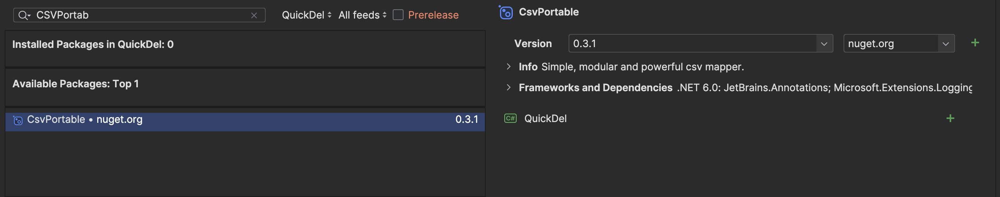

# CsvPortable
Simple, open &amp; free  Csv mapper libary for C# .NET Core

## Core Features
- easy **Serialization** and **Deserialization** of C# Objects 
- Objects that contain Objects are supported 
- Stream support for easy Integration 

## Getting Started 

### Add the Package: 

via IDE:


via terminal:

```
dotnet add package CSVPortable
```

manual:
- add 

```xml
  <ItemGroup>
      <PackageReference       Include="CSVPortable" Version="0.3.1" />
    </ItemGroup>
```
to the `.csproj` file.

### Code:
- [Hello World](./CsvPortable/HelloWorld/Program.cs)
- [Read & Write Files](./CsvPortable/ReadAndWriteFiles/Program.cs)
- [Export existing models](./Documentation/CreateReportsFromExistingModels.md)

